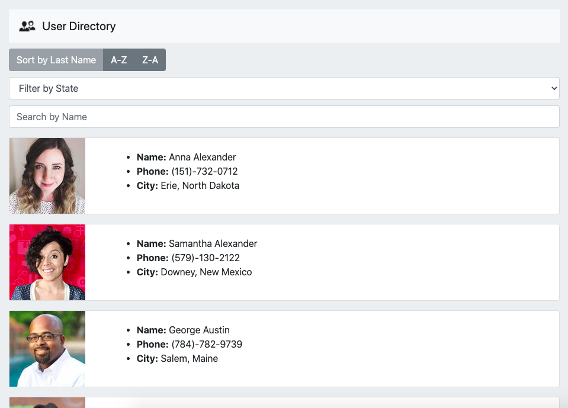
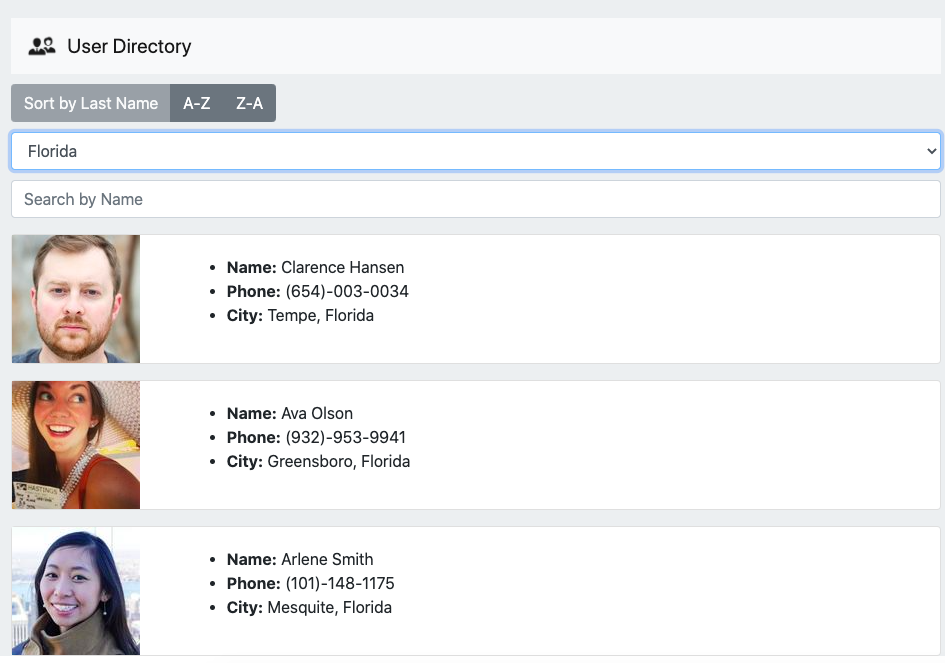
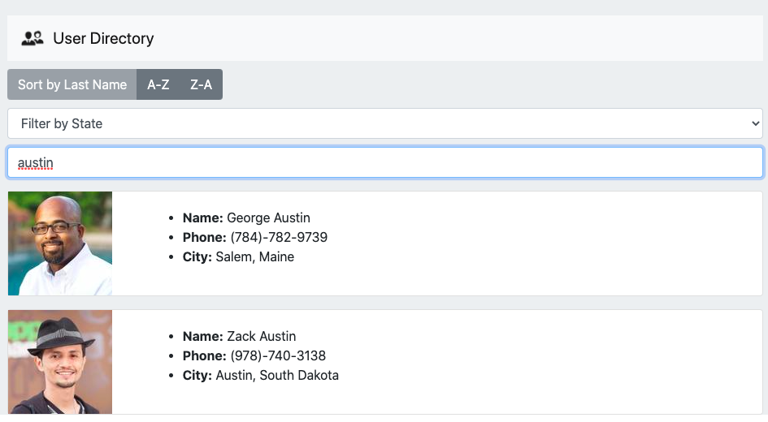

# User Directory

## Description

The application allows users to be able to view non-sensitive data at once, like an employee directory. The app uses React to break up the UI into components, to manage component state, and to respond to user events. 

Given a table of random users from [Random User Generator API](ndomuser.me), when the user loads the app, a table of employees renders. The user is able to:

  * Sort the table by last name.

  * Filter the users by US state.

  * Search the users dynamically by name.

## Table of Contents

* [Installation](#installation)
* [Usage](#usage)
* [Contributing](#contributing)
* [License](#license)
* [Questions](#questions)

## Installation

The app uses the following dependencies:
*    "axios": "^0.20.0",
*    "bootstrap": "^4.5.2",
*    "gh-pages": "^3.1.0",
*    "react": "^16.13.1",
*    "react-dom": "^16.13.1",
*    "react-scripts": "3.4.3"

## Usage

The app is run on Github Pages in this [link](https://tpacba.github.io/homework19-userdirectory/). 

You can also run the app in developer mode by running `npm start` in your terminal.

**Home Page**

**Filter By State (dropdown example: "Florida")**

**Search By Name (input example: "austin")**

## Contributing

Information for US states was rendered from [states_titlecase.json](https://gist.github.com/mshafrir/2646763/8303e1d831e89cb8af24a11f2fa77353c317e408) in Github.

## License

ISC

## Questions

If you have any questions, you can reach me through my email tpacba@live.com or connect with me on [GitHub](https://github.com/tpacba).